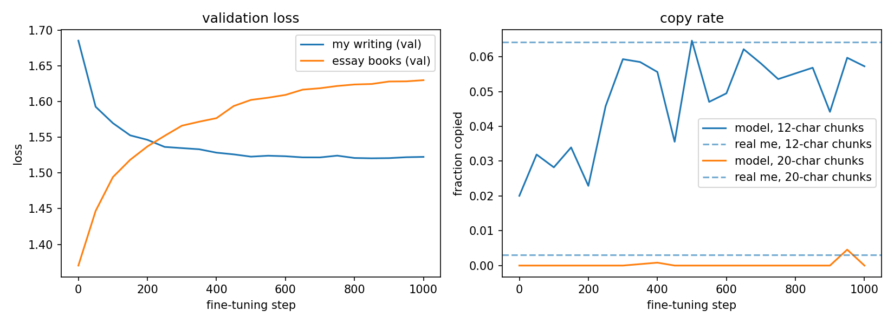

# write-like-me

**(attempting) to build llm that writes like me!**

**can a tiny language model learn to write like me? if it does, is it actually learning my writing style, or simply memorizing my sentences?**

i pretrained a small character-level GPT (2.7M parameters) on public-domaine ssays + fine-tuned it on ~17k words of my own writing, and measured when/where it shifts from imitating me to just quoting me.

## how does it work?
```
my essays + public-domain books
        │
   prepare.py   → clean text, build a shared character vocabulary, split train/val
        │
   train.py     → 2 rounds of training:
        ├─ pretrain:  ~2.5M characters of Emerson, Lamb, and Montaigne → learns English
        └─ fine-tune: ~88k characters of my writing                    → learns me
        │
   evaluate.py  → for every fine-tuning checkpoint: loss, forgetting, and copy rate
```

## current results


| fine-tuning step | loss on my writing | loss on books | copy rate (12 chars) | copy rate (20 chars) | longest copied span |
|---|---|---|---|---|---|
| 0 (pretrained only) | 1.685 | 1.370 | 0.020 | 0.000 | 20 chars |
| 100 | 1.570 | 1.494 | 0.028 | 0.000 | 15 chars |
| 300 | 1.535 | 1.566 | 0.059 | 0.000 | 23 chars |
| 500 | 1.523 | 1.602 | 0.065 | 0.000 | 21 chars |
| 1000 | 1.522 | 1.630 | 0.057 | 0.000 | 19 chars |
| **me (human baseline)** | | | **0.064** | **0.003** | |
